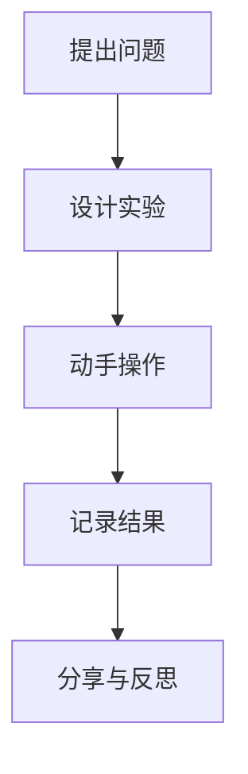

# 08-02 探索式学习设计-学生版

## 1. 主题简介

探索式学习是一种让我们主动发现问题、动手实验、合作探究的学习方式。它鼓励我们像小科学家一样，提出问题、寻找答案、分享发现。

## 2. 理论基础

- 建构主义：我们通过亲身体验和思考获得知识。
- 问题驱动：学习从一个有趣的问题开始。

## 3. 关键概念

| 概念 | 解释 | 举例 |
|------|------|------|
| 探索 | 主动发现和研究新事物 | 观察植物生长 |
| 合作 | 和同学一起完成任务 | 小组实验 |
| 反思 | 回顾学习过程和收获 | 写学习日记 |

## 4. 案例故事

- **科学实验**：我们小组设计了"水为什么会蒸发？"的实验，记录了不同条件下水的变化。
- **社会调研**：我们采访了社区居民，了解垃圾分类的现状，并提出改进建议。
- **家庭探索**：和爸爸妈妈一起观察家里的植物，记录它们的成长过程。

## 5. 多表征展示

## 6. 学习建议

- 主动提问，勇敢表达自己的想法
- 多动手实践，记录每一步发现
- 和同学合作，互相帮助
- 及时反思，总结经验

## 7. 推荐资源

- 科学小实验书籍
- 探索类动画片
- [08-02-探索式学习设计-案例](../08-02-探索式学习设计-案例.md)

---

> 本文档为自动生成内容草案，欢迎同学们补充自己的探索故事！
