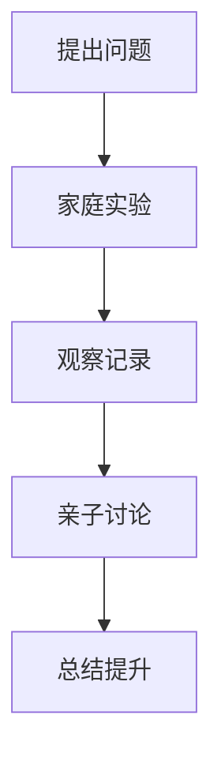

# 08-02 探索式学习设计-家长版

## 1. 主题简介
探索式学习设计强调孩子主动发现、动手实践和创新能力的培养，家庭是支持孩子探索成长的重要环境。

## 2. 理论基础
- 建构主义：孩子通过亲身体验和反思获得知识。
- 问题驱动：以真实问题为起点，激发学习兴趣。

## 3. 关键概念
| 概念 | 解释 | 家庭应用 |
|------|------|------|
| 探索 | 鼓励孩子主动提问和实验 | 家庭科学小实验 |
| 合作 | 亲子共同参与学习 | 一起做手工项目 |
| 反思 | 引导孩子总结经验 | 亲子对话、写观察日记 |

## 4. 家庭案例
- **亲子科学实验**：和孩子一起做"水的蒸发"实验，观察不同条件下的变化。
- **家庭调研**：带孩子走访社区，了解垃圾分类，讨论改进方法。
- **自然观察**：全家一起记录阳台植物的生长过程。

## 5. 多表征展示

## 6. 家庭支持建议
- 营造开放、鼓励提问的家庭氛围
- 参与孩子的探索活动，给予积极反馈
- 鼓励孩子记录和分享发现
- 关注过程，重视反思

## 7. 推荐资源
- 家庭科学实验书籍
- 亲子共学平台
- [08-02-探索式学习设计-知识图谱](../08-02-探索式学习设计-知识图谱.md)

---

> 本文档为自动生成内容草案，欢迎家长们结合实际补充更多亲子探索案例！ 