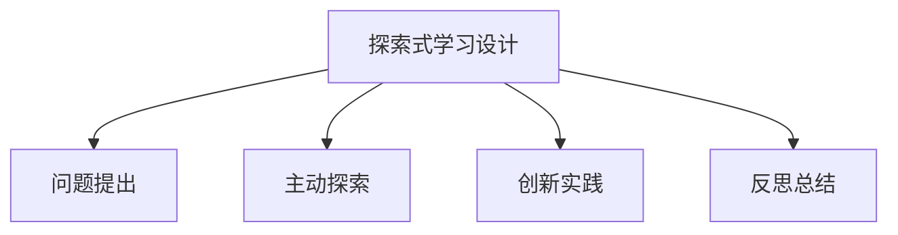

# 08-02 探索式学习设计-批判性分析

## 1. 主题简介

探索式学习设计是一种以学生为中心，强调主动探索、问题解决和创新能力培养的课程开发与教学模式。

## 2. 理论基础

- 建构主义学习理论
- 问题驱动学习（PBL）
- 国际探索式学习经验（如IB、芬兰现象课程等）

## 3. 关键概念与定义

| 概念 | 定义 | 例子 |
|------|------|------|
| 探索式学习 | 以问题为导向的主动学习过程 | 科学实验、社会调研 |
| 项目驱动 | 以真实项目引发学习兴趣 | 设计环保方案 |

## 4. 实践案例

- IB课程中的探索单元
- 芬兰现象课程探究活动
- 中国小学科学探究项目

## 5. 多表征分析

## 6. 教学建议

- 教师：引导学生提出问题，设计探索活动
- 家长：鼓励孩子自主探索，支持家庭项目
- 学生：主动思考，积极参与探索过程

## 7. 相关资源与拓展

- 推荐书籍：《探索式学习的力量》
- 相关主题：[08-02-探索式学习设计-教师版](../教师版/08-02-探索式学习设计-教师版.md)

---

> 本文档为自动生成内容草案，后续可根据实际教学与研究需要补充完善。
