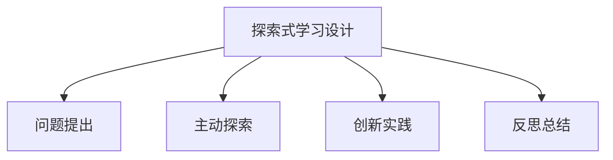

# 08-02 探索式学习设计-教师版

## 1. 主题简介

探索式学习设计是一种以学生为中心，强调主动探索、问题解决和创新能力培养的教学模式，适用于各学科融合与课程创新。

## 2. 理论基础

- 建构主义学习理论
- 问题驱动学习（PBL）
- 国际探索式学习经验（如IB、芬兰现象课程等）

## 3. 关键概念

| 概念 | 解释 | 教学应用 |
|------|------|------|
| 探索式学习 | 以问题为导向的主动学习过程 | 设计科学探究单元 |
| 项目驱动 | 以真实项目引发学习兴趣 | 社区调研、跨学科项目 |
| 反思总结 | 对学习过程和结果的回顾 | 课堂反思、成果展示 |

## 4. 教学案例

- **IB课程探索单元**：以"水的循环"为主题，学生自主设计实验并展示成果。
- **跨学科项目**：结合科学与社会，开展"社区垃圾分类"调研与改进方案设计。
- **家庭协作探究**：布置亲子观察任务，促进家校共育。

## 5. 多表征分析

## 6. 教学建议

- 引导学生提出有意义的问题
- 设计多样化的探索活动，关注过程性评价
- 鼓励学生合作与反思，促进创新能力发展
- 与家长沟通，形成家校协同支持

## 7. 推荐资源

- 探索式学习设计书籍与案例库
- 国际课程标准（IB、芬兰现象课程）
- [08-02-探索式学习设计-批判性分析](../08-02-探索式学习设计-批判性分析.md)

---

> 本文档为自动生成内容草案，欢迎教师结合实际教学进一步完善。
