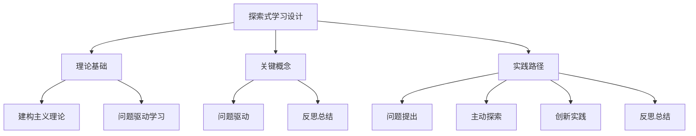

# 08-02 探索式学习设计-知识图谱

## 1. 主题简介

本知识图谱梳理探索式学习设计的核心概念、理论基础、实践路径及其相互关系，帮助教师、家长和学生系统理解该主题。

## 2. 理论基础

- 建构主义理论
- 问题驱动学习
- 国际探索式学习经验

## 3. 关键概念与定义

| 概念 | 定义 |
|------|------|
| 探索式学习设计 | 以学生为中心、强调主动探索和创新能力培养的课程开发与教学模式 |
| 问题驱动 | 以真实问题引发学习兴趣 |
| 反思总结 | 对学习过程和结果的回顾 |

## 4. 知识图谱结构



## 5. 教学建议

- 教师：利用知识图谱梳理探索活动设计思路
- 家长：参考图谱参与家庭探索
- 学生：通过图谱自查探索进展

## 6. 相关资源与拓展

- 推荐工具：XMind、MindMaster
- 相关主题：[08-02-探索式学习设计-案例](./08-02-探索式学习设计-案例.md)

---

> 本文档为自动生成内容草案，后续可根据实际教学与研究需要补充完善。

```mermaid
graph TD
    subgraph 核心定义与理论
        A("<b>探索式学习<br/>(Inquiry-Based Learning)</b>")
        A -- "核心是" --> A1("以学习者为中心<br>由真实问题驱动的主动建构过程")
        
        B("理论根源")
        A -- "植根于" --> B
        B --> B1("建构主义 (皮亚杰)")
        B --> B2("发现学习 (布鲁纳)")
        B --> B3("社会文化理论 (维果茨基)")
    end

    subgraph 应用范式与实施要素
        C("不同领域的探索范式")
        A -- "应用于" --> C
        C --> C1("<b>科学探索</b><br>遵循科学方法<br><i>(问题-假设-实验-结论)</i>")
        C --> C2("<b>哲学探索</b><br>运用苏格拉底式对话<br><i>(追问-辨析-反思)</i>")
        C --> C3("<b>知识探索</b><br>强调知识的结构化<br><i>(分类-连接-建构)</i>")

        D("关键实施要素")
        A -- "成功依赖于" --> D
        D1("1. 设计一个好的<br><b>驱动性问题</b>") --> D2("2. 提供恰到好处的<br><b>学习脚手架</b>")
        D2 --> D3("3. 促进深度的<br><b>协作与对话</b>") --> D4("4. 运用灵活的<br><b>过程性评估</b>")
    end

    subgraph 实践挑战 (关联批判性分析)
        E("核心挑战")
        A -- "实践中面临" --> E
        E --> E1(""混乱"与"结构"的困境")
        E --> E2("时间与课程大纲的压力")
        E --> E3("公平性与可及性的问题")
        E --> E4("过程与结果的评估难题")
        E --> E5("对教师"专业领航"的高要求")
    end

    style A fill:#cce,stroke:#333,stroke-width:2px
```
