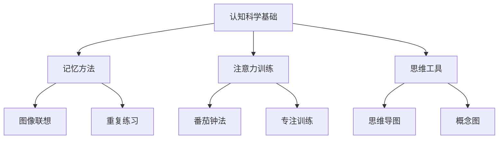

# 01-01 认知科学基础-学生版-案例

## 1. 主题简介
本节通过有趣的案例，帮助同学们了解认知科学的基础知识，包括我们的大脑是如何学习的，以及如何运用这些知识来提升学习效果。

## 2. 理论基础
- 认知科学：研究我们如何思考、学习和记忆的科学。
- 大脑可塑性：我们的大脑可以不断改变和成长。

## 3. 关键概念
| 概念 | 解释 | 举例 |
|------|------|------|
| 认知 | 我们思考和理解事物的过程 | 解数学题时的思考过程 |
| 记忆 | 大脑存储和提取信息的能力 | 记住新学的单词 |
| 注意力 | 专注于重要信息的能力 | 上课时认真听讲 |

## 4. 学生案例
### 案例1：记忆小达人
- 小明发现用图像联想的方法记单词特别有效，比如把"apple"想象成一个红苹果。
- 过程：发现方法→实践应用→效果验证→分享经验
- 收获：学会了适合自己的记忆方法，成绩提升明显。

### 案例2：注意力训练师
- 小红通过番茄钟法训练注意力，25分钟专注学习，5分钟休息。
- 过程：学习技巧→制定计划→坚持实践→总结效果
- 收获：注意力更集中，学习效率提高。

### 案例3：思维导图小能手
- 小华用思维导图整理知识点，把复杂的内容变得简单易懂。
- 过程：学习工具→应用实践→优化改进→成果展示
- 收获：逻辑思维更清晰，知识掌握更牢固。

## 5. 多表征展示

## 6. 学习建议
- 主动探索适合自己的学习方法
- 多尝试不同的记忆和思维技巧
- 坚持练习，培养良好的学习习惯
- 和同学分享经验，互相学习

## 7. 推荐资源
- 认知科学科普书籍
- 思维导图工具
- [01-01-认知科学基础-学生版](./01-01-认知科学基础-学生版.md)

---

> 本文档为自动生成内容草案，欢迎同学们补充自己的学习案例！
