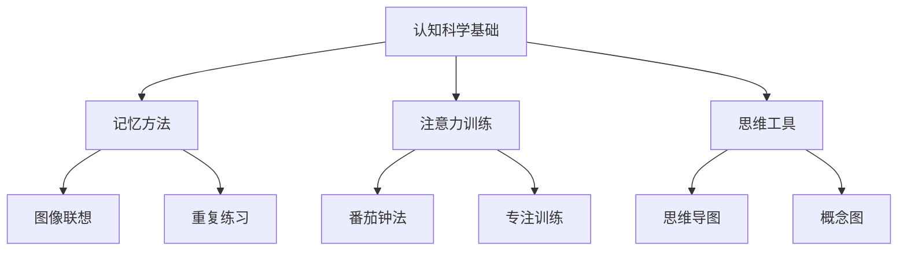

# 01-01-认知科学基础-家长版-案例

## 1. 主题简介
本节通过具体家庭案例，展示家长如何运用认知科学知识支持孩子的学习成长，促进亲子共学和能力发展。

## 2. 理论基础
- 认知科学：研究人类思维、学习和记忆的科学。
- 大脑可塑性：孩子的大脑具有强大的学习和适应能力。

## 3. 关键概念
| 概念 | 解释 | 家庭应用 |
|------|------|------|
| 认知 | 孩子思考和理解事物的过程 | 观察孩子解题思路 |
| 记忆 | 大脑存储和提取信息的能力 | 帮助孩子建立记忆方法 |
| 注意力 | 专注于重要信息的能力 | 创造专注学习环境 |

## 4. 家庭案例
### 案例1：记忆方法探索
- 家长与孩子一起探索图像联想记忆法，把抽象概念变成具体图像。
- 过程：学习理论→实践应用→效果观察→方法优化
- 收获：孩子记忆能力提升，学习兴趣增强。

### 案例2：注意力训练
- 家长帮助孩子制定番茄钟学习计划，培养专注力。
- 过程：制定计划→陪伴执行→调整优化→习惯养成
- 收获：孩子注意力更集中，学习效率提高。

### 案例3：思维导图应用
- 全家一起用思维导图整理知识点，让复杂内容变得简单。
- 过程：学习工具→亲子合作→实践应用→成果展示
- 收获：孩子逻辑思维更清晰，亲子关系更亲密。

## 5. 多表征展示

## 6. 家庭建议
- 了解认知科学基础知识，科学支持孩子学习
- 观察孩子的学习特点，提供个性化支持
- 创造良好的学习环境，培养专注力
- 鼓励孩子探索适合自己的学习方法

## 7. 推荐资源
- 认知科学科普书籍
- 思维导图工具
- [01-01-认知科学基础-家长版](./01-01-认知科学基础-家长版.md)

---

> 本文档为自动生成内容草案，欢迎家长们补充自己的家庭案例！
