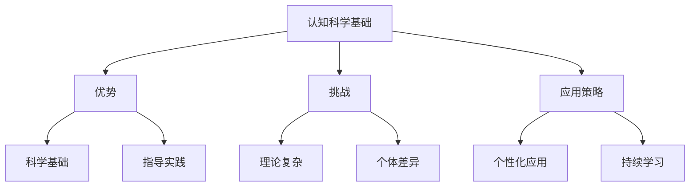

# 01-01-认知科学基础-教师版-批判性分析

## 1. 主题简介

认知科学基础作为教育理论的重要支撑，为教学实践提供了科学依据，但在实际应用中也需要审慎思考和批判性反思。

## 2. 理论基础

- 认知科学：研究人类思维、学习和记忆的科学。
- 大脑可塑性：大脑具有持续学习和适应的能力。

## 3. 关键概念

| 概念 | 解释 |
|------|------|
| 认知 | 人类思考和理解事物的过程 |
| 记忆 | 大脑存储和提取信息的能力 |
| 注意力 | 专注于重要信息的能力 |

## 4. 批判性分析

### 优势

- 为教学提供科学理论基础
- 帮助理解学生学习过程
- 指导教学策略设计

### 挑战

- 理论复杂，教师理解难度大
- 个体差异显著，应用需个性化
- 研究结论不断更新，需要持续学习

### 国际比较

- 美国、芬兰等国家在认知科学教育应用方面经验丰富
- 国内认知科学教育应用多处于探索阶段

## 5. 案例分析

- 基于认知负荷理论的教学设计
- 运用工作记忆原理优化课堂活动

## 6. 多表征分析

## 7. 教学建议

- 深入学习认知科学理论，提升专业素养
- 结合学生特点，个性化应用认知科学原理
- 关注国际前沿研究，持续更新教学理念
- 在实践中验证理论，形成本土化经验

## 8. 推荐资源

- 认知科学专业书籍
- 国际教育研究期刊
- [01-01-认知科学基础-教师版](./01-01-认知科学基础-教师版.md)

---

> 本文档为自动生成内容草案，欢迎教师结合实际教学进一步完善。
