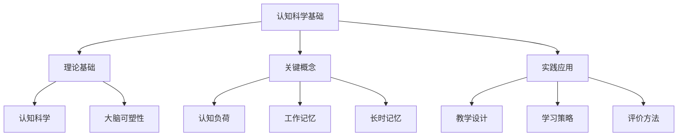

# 01-01-认知科学基础-教师版-知识图谱

## 1. 主题简介
本知识图谱梳理认知科学基础的核心概念、理论基础、实践应用及其相互关系，帮助教师系统理解该主题。

## 2. 理论基础
- 认知科学：研究人类思维、学习和记忆的科学。
- 大脑可塑性：大脑具有持续学习和适应的能力。

## 3. 关键概念
| 概念 | 解释 |
|------|------|
| 认知科学基础 | 研究人类思维、学习和记忆的科学理论基础 |
| 认知负荷 | 工作记忆处理信息的容量限制 |
| 工作记忆 | 临时存储和处理信息的系统 |

## 4. 知识图谱结构

## 5. 多表征展示
- 知识图谱结构图
- 概念表格
- 实践应用流程图

## 6. 教学建议
- 利用知识图谱梳理认知科学教学思路
- 结合学科特点应用认知科学原理
- 鼓励学生自主梳理知识结构

## 7. 推荐资源
- XMind、MindMaster等思维导图工具
- 认知科学专业书籍
- [01-01-认知科学基础-教师版-案例](./01-01-认知科学基础-教师版-案例.md)

---

> 本文档为自动生成内容草案，欢迎教师结合实际教学进一步完善。
