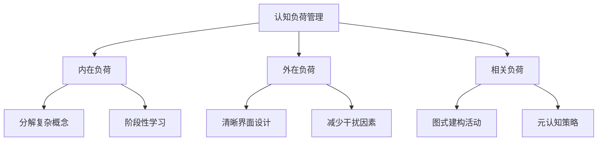
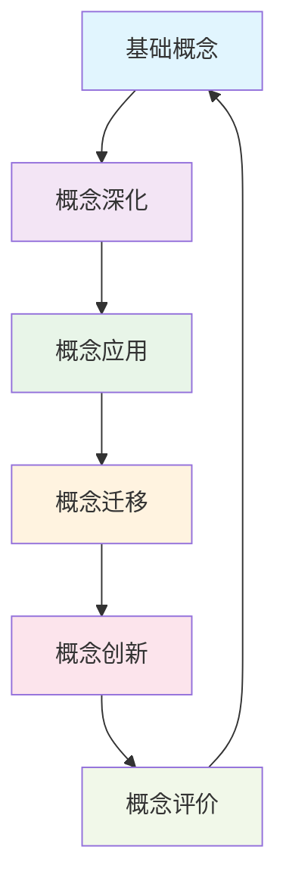
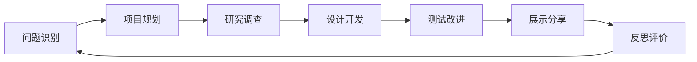

# 08-01 课程设计（教师版）

## 目录

1. [课程设计理论基础](#1-课程设计理论基础)
2. [现代课程设计原则](#2-现代课程设计原则)
3. [系统化设计框架](#3-系统化设计框架)
4. [多学科整合设计](#4-多学科整合设计)
5. [差异化课程设计](#5-差异化课程设计)
6. [技术支持的课程设计](#6-技术支持的课程设计)
7. [国际课程设计比较](#7-国际课程设计比较)
8. [实践案例与模板](#8-实践案例与模板)

---

## 1. 课程设计理论基础

### 1.1 认知科学基础

#### 建构主义理论应用

| 理论要素 | 课程设计应用 | 具体策略 |
|---------|------------|----------|
| 知识建构 | 渐进式知识建构 | 螺旋式课程结构 |
| 先前经验 | 经验连接点设计 | 激活先前知识活动 |
| 社会建构 | 协作学习机制 | 小组探究项目 |
| 情境学习 | 真实情境创设 | 问题导向学习 |

#### 认知负荷理论



### 1.2 学习理论整合

#### 多元智能理论应用

- **语言智能课程模块**：阅读、写作、演讲、辩论
- **逻辑数学智能模块**：问题解决、模式识别、推理
- **空间智能模块**：几何、艺术、地图阅读
- **音乐智能模块**：节奏学习、音乐创作
- **身体运动智能模块**：体育、手工、实验操作
- **人际智能模块**：合作学习、同伴教学
- **内省智能模块**：反思日记、自主学习规划

#### 学习风格理论

| 学习风格 | 课程设计策略 | 具体活动 |
|---------|------------|----------|
| 视觉型 | 图表、图像、视频 | 思维导图制作 |
| 听觉型 | 讨论、音频、朗读 | 播客制作项目 |
| 动觉型 | 实验、建构、游戏 | 实物模型搭建 |
| 阅读型 | 文本、笔记、研究 | 主题研究报告 |

---

## 2. 现代课程设计原则

### 2.1 核心设计原则

#### 2.1.1 逆向设计原则

```
目标设定 → 评价设计 → 学习体验设计 → 教学活动安排
```

**实施步骤：**

1. **确定预期学习成果**
   - 学科标准对接
   - 21世纪技能整合
   - 个人成长目标

2. **设计评价方式**
   - 形成性评价嵌入
   - 真实性评价任务
   - 自评与互评结合

3. **规划学习体验**
   - 探究式学习路径
   - 多感官体验设计
   - 反思机会创造

#### 2.1.2 以学习者为中心

| 传统设计 | 学习者中心设计 |
|---------|--------------|
| 教师主导内容传递 | 学生主动知识建构 |
| 标准化学习路径 | 个性化学习旅程 |
| 被动接受信息 | 主动探索发现 |
| 单一评价标准 | 多元评价方式 |

### 2.2 跨学科整合原则

#### STEAM教育整合

- **S**cience（科学）：观察、假设、实验
- **T**echnology（技术）：数字工具应用
- **E**ngineering（工程）：设计思维、问题解决
- **A**rt（艺术）：创意表达、美学体验
- **M**athematics（数学）：数据分析、逻辑推理

#### 主题式整合示例

**主题：可持续发展**

- 科学：生态系统研究
- 数学：数据收集与分析
- 语言：环保主题写作
- 艺术：环保海报设计
- 社会：政策分析讨论

---

## 3. 系统化设计框架

### 3.1 课程架构设计

#### 螺旋式课程模型



#### 单元设计结构

1. **单元概述**（Unit Overview）
   - 学习目标
   - 核心概念
   - 关键技能
   - 评价标准

2. **引入阶段**（Engage）
   - 激发兴趣活动
   - 先前知识激活
   - 学习问题提出

3. **探索阶段**（Explore）
   - 调查研究活动
   - 协作探索任务
   - 数据收集分析

4. **解释阶段**（Explain）
   - 概念阐释
   - 模式识别
   - 理论联系实际

5. **拓展阶段**（Extend）
   - 应用实践
   - 迁移练习
   - 创新项目

6. **评价阶段**（Evaluate）
   - 学习成果展示
   - 反思总结
   - 改进计划

### 3.2 学习目标设计

#### SMART目标原则

- **S**pecific（具体的）：明确的学习成果
- **M**easurable（可测量的）：可观察的行为表现
- **A**chievable（可达成的）：符合学生能力水平
- **R**elevant（相关的）：与生活和未来发展相关
- **T**ime-bound（有时限的）：明确的完成时间

#### 布鲁姆分类法应用

| 认知层次 | 动词示例 | 课程活动设计 |
|---------|---------|------------|
| 记忆 | 列举、识别、描述 | 概念卡片、术语匹配 |
| 理解 | 解释、总结、举例 | 概念图制作、案例分析 |
| 应用 | 使用、解决、演示 | 实验操作、问题解决 |
| 分析 | 比较、分类、推断 | 数据分析、模式识别 |
| 综合 | 创造、设计、组合 | 项目设计、作品创作 |
| 评价 | 评估、判断、论证 | 同伴评价、标准应用 |

---

## 4. 多学科整合设计

### 4.1 主题式整合课程

#### 设计步骤

1. **主题选择**
   - 社会相关性
   - 学科连接度
   - 学生兴趣点
   - 年龄适宜性

2. **学科映射**
   - 各学科核心概念识别
   - 跨学科连接点分析
   - 技能整合机会
   - 评价标准统一

3. **活动设计**
   - 真实情境创设
   - 多元表征方式
   - 协作学习机会
   - 反思总结环节

#### 整合课程示例：《水的旅行》

**科学维度：**

- 水循环概念
- 状态变化实验
- 环境影响分析

**数学维度：**

- 降水量统计
- 图表制作
- 比例计算

**语言维度：**

- 科学日记写作
- 研究报告撰写
- 演讲展示

**艺术维度：**

- 水循环图绘制
- 雨水音乐创作
- 环保海报设计

### 4.2 项目式学习设计

#### PBL设计要素

- **驱动问题**：开放性、挑战性问题
- **真实性**：与现实世界连接
- **学生声音**：学生参与决策
- **21世纪技能**：批判思维、协作、沟通
- **创新**：原创性产品或解决方案
- **公开展示**：向真实受众展示
- **反思**：过程和产品反思

#### 项目设计流程



---

## 5. 差异化课程设计

### 5.1 多层次学习设计

#### 分层教学策略

| 学习层次 | 设计特点 | 活动示例 |
|---------|---------|----------|
| 基础层 | 概念理解、基本技能 | 概念映射、模仿练习 |
| 发展层 | 应用迁移、深度思考 | 案例分析、问题解决 |
| 挑战层 | 创新综合、批判评价 | 研究项目、设计挑战 |

#### 多入口设计

- **兴趣入口**：从学生兴趣点开始
- **经验入口**：连接生活经验
- **智能入口**：发挥智能优势
- **文化入口**：尊重文化背景

### 5.2 个性化学习支持

#### 学习者画像分析

1. **认知特点**
   - 学习风格偏好
   - 认知能力水平
   - 先前知识基础

2. **情感特征**
   - 学习动机类型
   - 兴趣爱好领域
   - 自信心水平

3. **社会背景**
   - 家庭教育环境
   - 文化背景影响
   - 同伴关系状况

#### 适应性调整策略

- **内容调整**：难度、广度、深度
- **过程调整**：时间、步骤、支持
- **产品调整**：形式、标准、展示
- **环境调整**：空间、工具、氛围

---

## 6. 技术支持的课程设计

### 6.1 数字化学习环境

#### 技术整合模型（TPACK）

- **T**echnological Knowledge：技术知识
- **P**edagogical Knowledge：教学知识
- **C**ontent Knowledge：学科知识

#### 数字工具应用

| 工具类型 | 功能作用 | 课程应用 |
|---------|---------|----------|
| 创作工具 | 内容创建、多媒体制作 | 数字故事、演示文稿 |
| 协作平台 | 团队合作、资源共享 | 在线项目、同伴反馈 |
| 评价工具 | 学习追踪、数据分析 | 学习分析、进度监控 |
| 模拟软件 | 虚拟实验、概念可视化 | 科学模拟、数学建模 |

### 6.2 混合式学习设计

#### 线上线下融合

- **翻转课堂模式**
  - 线上：概念学习、资源探索
  - 线下：应用实践、深度讨论

- **轮转模式**
  - 在线学习站
  - 小组协作站
  - 教师指导站
  - 独立练习站

---

## 7. 国际课程设计比较

### 7.1 主要国际课程框架

#### 国际文凭课程（IB）

**设计特点：**

- 概念驱动学习
- 探究式教学
- 国际化视野
- 全人教育理念

**课程组织：**

- 六个学科组
- 核心要素（TOK、CAS、EE）
- 跨学科学习
- 反思实践

#### 剑桥国际课程

**设计原则：**

- 技能导向
- 灵活适应
- 全球认可
- 质量保证

**课程特色：**

- 渐进式能力发展
- 多样化评价方式
- 文化敏感性
- 创新思维培养

### 7.2 芬兰现象式学习

#### 设计理念

- 跨学科主题学习
- 真实问题解决
- 学生主导探究
- 教师协作教学

#### 实施策略

1. **主题选择**：学生兴趣+社会需求
2. **团队教学**：多学科教师合作
3. **灵活时间**：打破传统课表
4. **真实评价**：作品集+展示

---

## 8. 实践案例与模板

### 8.1 单元设计模板

#### 单元规划表

```
单元名称：_________________
学习时长：_________________
年级水平：_________________

学习目标：
1. 知识目标：
2. 技能目标：
3. 情感目标：

核心概念：
- 
- 
- 

关键问题：
1. 
2. 
3. 

评价任务：
- 形成性评价：
- 总结性评价：

学习活动序列：
第1课时：
第2课时：
第3课时：
...

资源需求：
- 教学材料：
- 技术工具：
- 外部资源：

差异化策略：
- 内容差异：
- 过程差异：
- 产品差异：
```

### 8.2 项目设计案例

#### 案例：《我们的社区环境调查》

**项目概述：**
学生团队调查分析本地环境问题，提出改善方案并向社区展示。

**驱动问题：**
"如何让我们的社区变得更加环保和宜居？"

**学科整合：**

- **科学**：环境监测、数据收集
- **数学**：统计分析、图表制作
- **语言**：调查报告、演讲展示
- **社会**：政策分析、公民参与
- **艺术**：宣传海报、多媒体展示

**项目阶段：**

1. **问题探索**（1周）
   - 社区环境观察
   - 问题识别分类
   - 研究计划制定

2. **调查研究**（2周）
   - 实地数据收集
   - 专家访谈
   - 资料查阅分析

3. **方案设计**（2周）
   - 改善方案构思
   - 可行性分析
   - 成本效益评估

4. **展示交流**（1周）
   - 成果制作
   - 社区展示
   - 反馈收集

**评价标准：**

- 调查方法科学性
- 数据分析准确性
- 方案创新实用性
- 展示沟通有效性
- 团队协作质量

### 8.3 课程实施指南

#### 实施准备

1. **教师准备**
   - 专业知识更新
   - 教学技能培训
   - 协作团队建立

2. **资源准备**
   - 教学材料收集
   - 技术设备配置
   - 外部资源联系

3. **环境准备**
   - 学习空间布置
   - 氛围营造
   - 安全措施

#### 实施过程

- **开始阶段**：目标明确、期望设定
- **进行阶段**：过程监控、及时调整
- **结束阶段**：总结反思、经验提炼

#### 质量保证

- **同伴观察**：教师互相学习
- **学生反馈**：持续改进依据
- **成果评价**：多维度评估
- **专业发展**：持续学习成长

---

## 持续性上下文提醒

### 认知科学基础连接

- 建构主义学习理论 → 学生主导的知识建构过程
- 认知负荷理论 → 合理的信息处理设计
- 多元智能理论 → 多样化的学习路径设计

### 教育哲学理念整合

- 以学习者为中心 → 个性化课程设计
- 全人教育 → 认知、情感、社会发展并重
- 终身学习 → 学习能力的培养

### 实践应用导向

- 理论指导实践 → 具体可操作的设计方法
- 循证决策 → 基于研究证据的设计选择
- 持续改进 → 反思评估的设计文化

### 国际化视野

- 多元文化尊重 → 包容性课程设计
- 全球胜任力 → 21世纪技能整合
- 可持续发展 → 未来导向的教育设计
