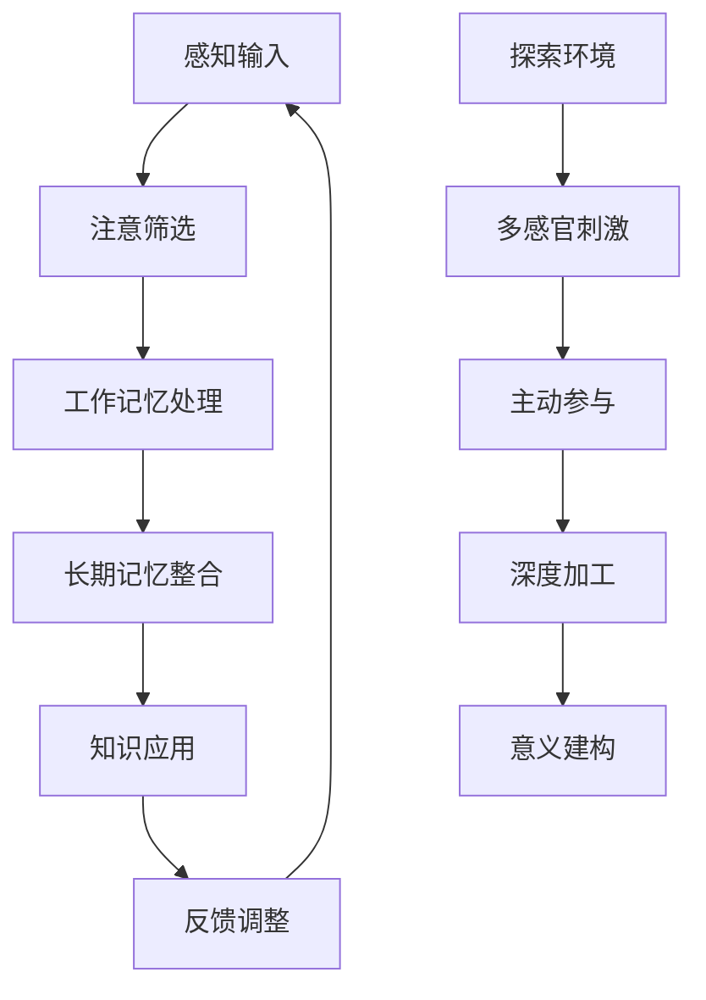
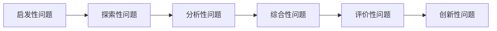
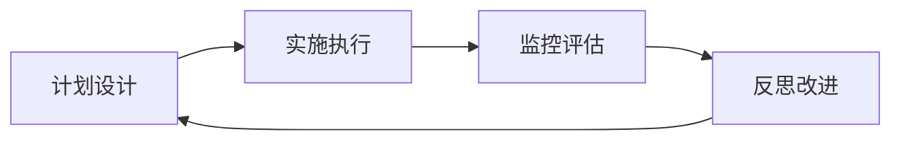

# 08-02 探索式学习设计（教师版）

## 目录

1. [探索式学习理论基础](#1-探索式学习理论基础)
2. [探索式学习设计原则](#2-探索式学习设计原则)
3. [探索环境创设](#3-探索环境创设)
4. [引导策略与技巧](#4-引导策略与技巧)
5. [评价与反馈机制](#5-评价与反馈机制)
6. [数字时代的探索学习](#6-数字时代的探索学习)
7. [实践案例分析](#7-实践案例分析)
8. [挑战与解决方案](#8-挑战与解决方案)

---

## 1. 探索式学习理论基础

### 1.1 理论渊源与发展

#### 建构主义认识论

- **皮亚杰的认知发展理论**：学习是主动建构知识的过程
- **维果茨基的社会文化理论**：学习发生在社会互动中
- **布鲁纳的发现学习理论**：通过发现获得的知识更持久

#### 探索式学习的核心特征

| 特征 | 描述 | 教学意义 |
|-----|------|----------|
| 主动性 | 学生主导学习过程 | 教师转变为引导者角色 |
| 探究性 | 通过问题解决学习 | 设计真实有意义的问题 |
| 体验性 | 通过亲身体验获得知识 | 创设丰富的学习体验 |
| 反思性 | 对学习过程进行反思 | 建立反思机制和习惯 |

### 1.2 认知科学支撑

#### 大脑学习机制



#### 神经可塑性原理

- **神经连接强化**：反复探索强化神经通路
- **突触可塑性**：新体验形成新的神经连接
- **默认模式网络**：反思和整合促进深度理解

### 1.3 学习理论整合

#### 体验学习循环（Kolb）

1. **具体体验**（Concrete Experience）
   - 直接参与活动
   - 感性认识阶段
   - 激发学习兴趣

2. **反思观察**（Reflective Observation）
   - 观察和思考体验
   - 发现问题和模式
   - 形成初步理解

3. **抽象概括**（Abstract Conceptualization）
   - 形成理论和概念
   - 建立知识框架
   - 理性认识阶段

4. **主动实验**（Active Experimentation）
   - 验证和应用知识
   - 解决新问题
   - 迁移和创新

---

## 2. 探索式学习设计原则

### 2.1 核心设计原则

#### 2.1.1 问题驱动原则

**有效问题特征：**

- **真实性**：来源于现实生活或学科实践
- **开放性**：有多种解决路径和答案
- **挑战性**：略高于学生当前能力水平
- **相关性**：与学生经验和兴趣相关

**问题设计层次：**

```
第三层：创造性问题 - "如何设计一个...?"
         ⬆️
第二层：分析性问题 - "为什么会...?"
         ⬆️
第一层：事实性问题 - "什么是...?"
```

#### 2.1.2 支架式指导原则

**支架设计要素：**

- **适时性**：在学生需要时提供支持
- **适量性**：提供必要但不过度的帮助
- **适应性**：根据学生能力调整支架
- **渐退性**：逐步撤除外部支持

#### 2.1.3 协作探索原则

**协作学习设计：**

- **异质分组**：不同能力和背景的学生组合
- **明确分工**：每个成员都有具体责任
- **相互依赖**：个人成功依赖团队成功
- **个体问责**：每个人都要承担学习责任

### 2.2 学习环境设计

#### 物理环境要求

| 空间要素 | 设计考虑 | 功能目的 |
|---------|---------|----------|
| 开放性 | 可移动的桌椅、灵活布局 | 支持多样化活动 |
| 资源性 | 丰富的学习材料和工具 | 促进主动探索 |
| 展示性 | 学习成果展示空间 | 激励和分享 |
| 舒适性 | 良好的光线、温度、声音 | 营造积极氛围 |

#### 心理环境营造

**安全探索氛围：**

- 接纳错误和失败
- 鼓励冒险和尝试
- 尊重不同观点
- 建立信任关系

**激发好奇文化：**

- 提出开放性问题
- 展示学习过程
- 庆祝发现和洞察
- 建立探索传统

---

## 3. 探索环境创设

### 3.1 实体探索环境

#### 科学探索区

**必备设施：**

- 🔬 显微镜和放大镜
- ⚗️ 基础实验器材
- 📊 测量和记录工具
- 🌱 生物观察材料
- 📚 参考资料和指南

**安全管理：**

- 制定实验室安全规则
- 提供安全防护设备
- 建立应急处理程序
- 培训安全操作技能

#### 创客空间设计

**功能区划：**

- **设计区**：草图绘制、方案讨论
- **制作区**：工具使用、材料加工
- **测试区**：原型测试、效果验证
- **展示区**：作品展示、经验分享

**工具配置：**

- 基础手工工具
- 3D打印机
- 编程设备
- 艺术创作材料

### 3.2 数字探索环境

#### 虚拟实验室

**优势特点：**

- 突破时空限制
- 安全无风险
- 可重复操作
- 数据精确记录

**应用领域：**

- 化学反应模拟
- 物理定律验证
- 生物过程观察
- 历史场景重现

#### 在线协作平台

**功能要求：**

- 实时协作编辑
- 多媒体内容支持
- 版本控制管理
- 评论和反馈机制

### 3.3 混合现实环境

#### AR增强现实应用

**教学场景：**

- 3D模型观察
- 虚拟标本解剖
- 历史场景还原
- 地理环境探索

#### VR虚拟现实体验

**沉浸式学习：**

- 微观世界探索
- 极端环境体验
- 历史事件参与
- 未来场景预测

---

## 4. 引导策略与技巧

### 4.1 提问艺术

#### 苏格拉底式提问法

**提问层次：**

1. **澄清思维**："你能举个例子吗？"
2. **质疑假设**："你认为这个假设成立吗？"
3. **检验证据**："什么证据支持这个观点？"
4. **考虑视角**："其他人会怎么看这个问题？"
5. **探索含义**："如果这样，会导致什么结果？"
6. **反思过程**："这改变了你的想法吗？"

#### 问题序列设计



### 4.2 引导时机把握

#### 学习困难诊断

**认知困难信号：**

- 长时间无进展
- 重复尝试失败
- 表现出挫折情绪
- 寻求帮助行为

**干预时机选择：**

- **立即干预**：安全问题、基本概念错误
- **延迟干预**：允许充分尝试和思考
- **间接干预**：通过同伴或资源提供帮助
- **不干预**：学生能够自主解决

### 4.3 支架搭建技巧

#### 认知支架类型

| 支架类型 | 功能作用 | 应用策略 |
|---------|---------|----------|
| 概念支架 | 提供思维框架 | 概念图、思维导图 |
| 程序支架 | 指导操作步骤 | 流程图、检查清单 |
| 策略支架 | 指导解决方法 | 策略提示卡、范例 |
| 元认知支架 | 促进反思监控 | 自我评价表、反思提示 |

#### 支架撤除策略

**渐进式撤除：**

1. 完全示范 → 2. 引导练习 → 3. 独立尝试 → 4. 自主应用

**适应性调整：**

- 根据学生表现调整支架强度
- 为不同学生提供差异化支架
- 建立同伴支架系统

---

## 5. 评价与反馈机制

### 5.1 形成性评价设计

#### 过程性评价指标

**探索态度评价：**

- 主动性：是否主动提出问题和假设
- 坚持性：面对困难是否持续尝试
- 开放性：是否接受不同观点和方法
- 反思性：是否对过程进行思考总结

**探索技能评价：**

- 观察技能：细致观察和记录能力
- 实验技能：设计和实施实验能力
- 分析技能：数据分析和模式识别
- 交流技能：表达和分享发现能力

#### 实时反馈机制

**数字化评价工具：**

- 在线学习日志
- 实时投票系统
- 数字作品集
- 同伴评价平台

### 5.2 总结性评价设计

#### 真实性评价任务

**项目展示评价：**

- 作品质量：创新性、完整性、美观性
- 展示能力：表达清晰、逻辑性、感染力
- 问题回答：深度理解、灵活应用
- 团队合作：协作过程、贡献程度

#### 多元化评价方式

| 评价方式 | 评价内容 | 适用场景 |
|---------|---------|----------|
| 作品集评价 | 学习过程和成果 | 长期项目学习 |
| 表现性评价 | 实际操作技能 | 实验和制作活动 |
| 同伴评价 | 合作和交流能力 | 小组协作学习 |
| 自我评价 | 反思和元认知 | 个人成长记录 |

### 5.3 反馈优化策略

#### 有效反馈特征

**及时性**：在学习发生时或之后立即提供
**具体性**：针对具体行为和表现给出意见
**建设性**：既指出问题也提供改进建议
**激励性**：增强学习动机和自信心

#### 反馈技巧应用

**三明治反馈法：**

1. 肯定优点和进步
2. 指出需要改进的地方
3. 提供具体改进建议
4. 表达信心和期望

---

## 6. 数字时代的探索学习

### 6.1 技术增强探索

#### AI辅助探索学习

**个性化学习路径：**

- 根据学习风格推荐资源
- 智能调整学习难度
- 预测学习困难点
- 提供个性化支架

**智能问答系统：**

- 24/7可用的学习助手
- 多轮对话式指导
- 知识图谱支持
- 多模态交互接口

#### 大数据学习分析

**学习行为追踪：**

- 探索路径记录
- 时间分配分析
- 错误模式识别
- 成长轨迹可视化

### 6.2 在线探索社区

#### 全球协作学习

**跨地域项目：**

- 环境监测合作
- 文化交流探索
- 科学数据共享
- 创新解决方案

#### 专家导师网络

**在线专家指导：**

- 实时视频答疑
- 专业领域指导
- 职业发展规划
- 研究方法培训

### 6.3 创新技术应用

#### 物联网探索实验

**传感器网络：**

- 环境数据收集
- 实时监测分析
- 趋势预测建模
- 决策支持系统

#### 区块链学习记录

**去中心化认证：**

- 学习成果记录
- 技能认证管理
- 同伴评价验证
- 终身学习档案

---

## 7. 实践案例分析

### 7.1 科学探索案例

#### 案例：《水质检测与环境保护》

**探索目标：**
理解水质指标，掌握检测方法，培养环保意识

**探索过程设计：**

**阶段1：问题发现（1周）**

- **驱动问题**："我们周围的水质量如何？"
- **初始体验**：观察不同水源的外观、气味
- **疑问激发**：为什么水会有不同的颜色和味道？
- **假设形成**：学生提出关于水质差异的假设

**阶段2：方法探索（2周）**

- **资料调研**：了解水质检测标准和方法
- **实验设计**：设计简单的水质检测实验
- **工具使用**：学习使用pH试纸、TDS笔等工具
- **数据收集**：采集不同水源样本进行检测

**阶段3：深入分析（2周）**

- **数据整理**：制作水质检测数据表格
- **模式识别**：分析不同水源的质量差异
- **原因探究**：研究影响水质的各种因素
- **解决方案**：提出改善水质的方法

**阶段4：行动实践（1周）**

- **方案设计**：制定家庭或社区水质改善计划
- **宣传教育**：制作环保宣传材料
- **实际行动**：参与净水或节水活动
- **效果评估**：评价行动的实际效果

**评价机制：**

- **过程评价**：观察记录、实验报告、讨论参与
- **成果评价**：数据分析报告、改善方案设计
- **反思评价**：学习日志、自我评价、同伴评价

### 7.2 数学探索案例

#### 案例：《黄金比例的发现之旅》

**探索设计框架：**

**引入阶段：现象观察**

- 观察自然界中的美丽图案（向日葵、贝壳等）
- 分析艺术作品中的比例关系
- 提出问题：什么使这些事物如此美丽？

**探索阶段：模式发现**

- 测量和计算不同对象的比例
- 寻找共同的数学规律
- 发现黄金比例的存在

**深化阶段：概念建构**

- 研究黄金比例的数学表达
- 探索斐波那契数列的关系
- 理解无理数的概念

**应用阶段：创造实践**

- 用黄金比例设计艺术作品
- 在建筑设计中应用比例原理
- 分析现代设计中的数学美

### 7.3 人文探索案例

#### 案例：《家族历史探索项目》

**多维度探索设计：**

**历史维度：**

- 家族迁移路线追踪
- 重要历史事件影响分析
- 时代背景研究

**地理维度：**

- 祖籍地理环境分析
- 迁移路线地图制作
- 地理因素影响探讨

**社会维度：**

- 家族职业变迁分析
- 社会地位变化研究
- 教育发展历程

**文化维度：**

- 家族传统习俗记录
- 方言变化追踪
- 文化传承分析

**现代技术应用：**

- DNA分析技术
- 数字化档案建设
- 在线族谱平台
- 多媒体展示制作

---

## 8. 挑战与解决方案

### 8.1 常见挑战识别

#### 学生层面挑战

**依赖性过强**

- 表现：习惯被动接受，不敢独立探索
- 原因：传统教育模式影响，缺乏自信
- 解决策略：
  - 从小步骤开始，逐渐增加挑战
  - 建立支持性环境，鼓励尝试
  - 示范独立思考过程

**挫折耐受性低**

- 表现：遇到困难容易放弃
- 原因：成长心态不足，害怕失败
- 解决策略：
  - 重新定义失败为学习机会
  - 分享科学家的失败故事
  - 建立小步骤成功体验

#### 教师层面挑战

**角色转换困难**

- 传统控制习惯 → 引导促进者
- 知识传授者 → 学习合作者
- 标准答案提供者 → 开放性问题设计者

**时间管理压力**

- 探索学习耗时较长
- 课程进度压力
- 评价标准适应

### 8.2 系统性解决方案

#### 教师专业发展

**理论学习：**

- 探索式学习理论培训
- 认知科学基础知识
- 现代教育技术应用

**实践训练：**

- 教学设计工作坊
- 同伴观摩和反馈
- 行动研究项目

**支持系统：**

- 专业学习共同体
- 在线资源平台
- 专家指导网络

#### 制度环境优化

**评价改革：**

- 多元化评价体系
- 过程性评价权重
- 个性化发展记录

**资源配置：**

- 探索学习空间建设
- 教学工具和材料
- 技术平台支持

**文化建设：**

- 创新探索氛围
- 错误友好环境
- 持续改进文化

### 8.3 质量保证机制

#### 教学质量监控

**多维度评价：**

- 学生学习成果评估
- 教学过程质量分析
- 长期发展效果追踪

**持续改进循环：**



#### 专业标准建立

**探索式教学能力标准：**

- 探索环境设计能力
- 问题驱动教学技能
- 学生指导策略运用
- 多元评价实施能力

---

## 持续性上下文提醒

### 认知科学基础应用

- 主动学习理论 → 学生主导的探索过程
- 认知负荷管理 → 适度挑战的任务设计
- 社会认知理论 → 协作探索的学习环境

### 建构主义学习理念

- 知识建构过程 → 从体验到理解的学习路径
- 先前经验重要性 → 联系生活的探索主题
- 社会互动价值 → 合作探索的学习方式

### 现代教育技术整合

- 数字化工具 → 增强探索的深度和广度
- 人工智能 → 个性化探索学习支持
- 在线协作 → 全球化探索学习网络

### 21世纪技能培养

- 批判思维 → 质疑和分析的探索过程
- 创新能力 → 开放性问题解决
- 协作技能 → 团队探索项目
- 数字素养 → 技术支持的探索活动

### 个性化教育理念

- 多元智能 → 多样化探索途径
- 学习风格 → 适应性探索环境
- 发展差异 → 差异化探索支持
- 兴趣驱动 → 个人兴趣导向的探索
