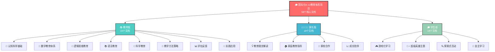
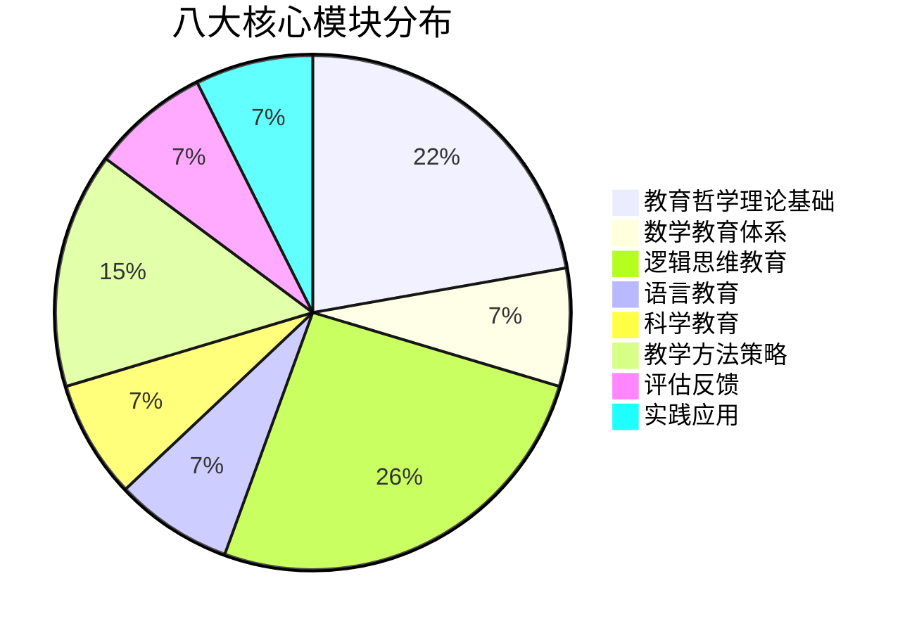
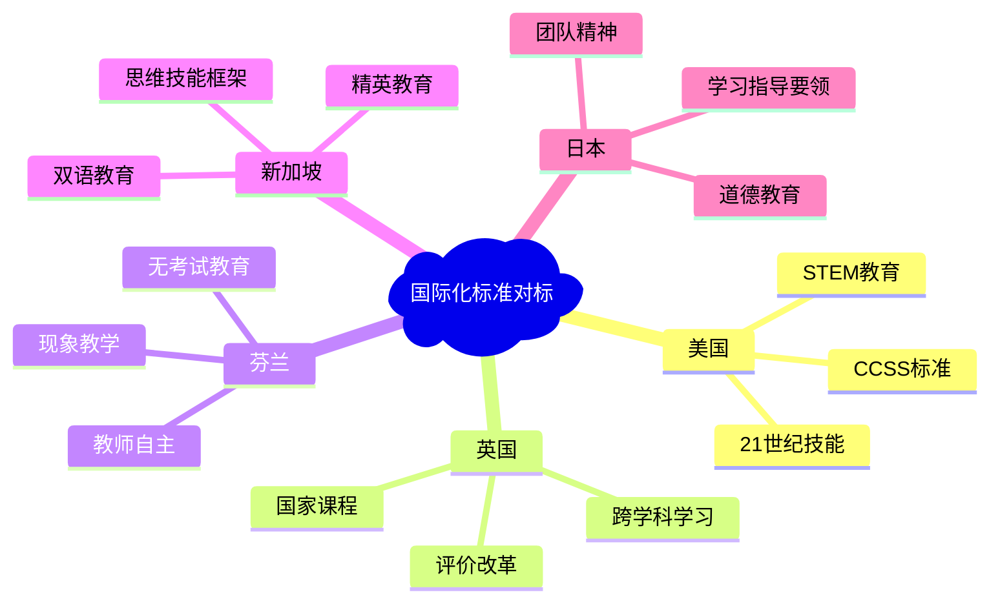
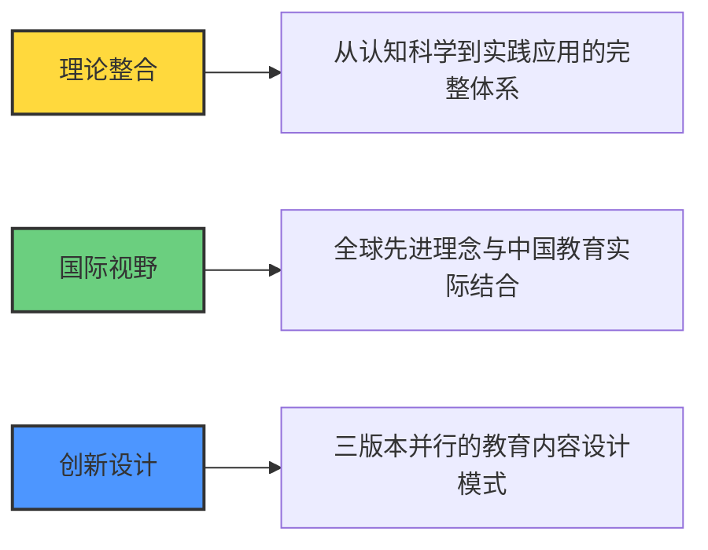
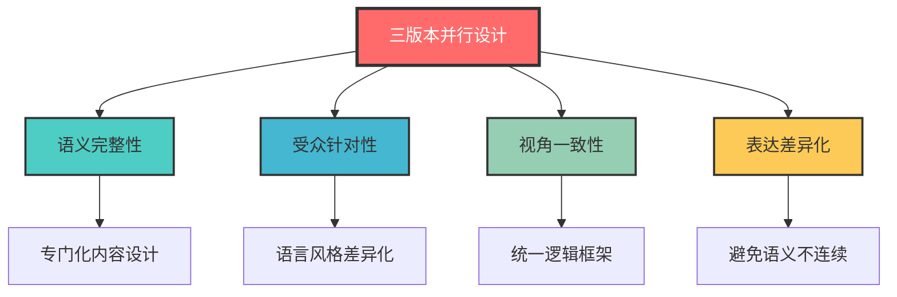
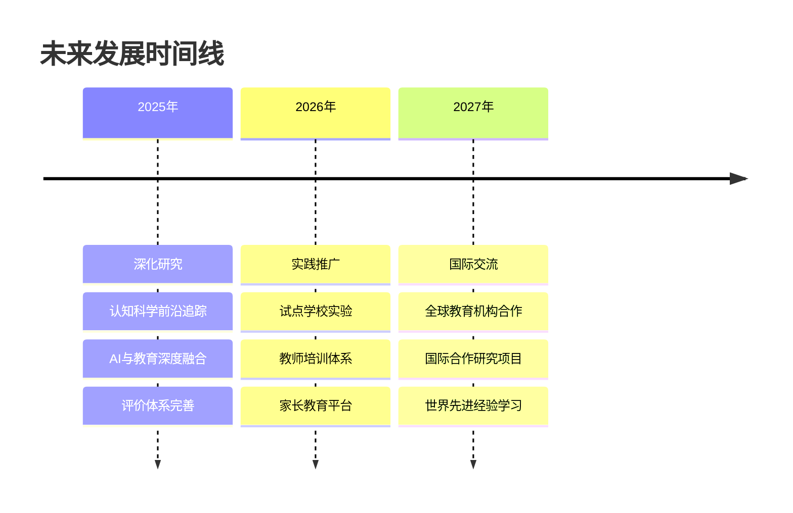

# 项目结构可视化总览

## 🎓 国际化K-12教育体系项目架构图

## 📊 项目完成度统计

### 整体完成情况
- **项目状态**：✅ 已圆满完成
- **完成时间**：2024年12月
- **文档总数**：58个核心文档
- **质量标准**：达到最高质量标准

### 分版本完成统计

| 版本 | 文档数量 | 完成状态 | 特色亮点 |
|------|----------|----------|----------|
| 📚 **教师版** | 22个文档 | ✅ 100%完成 | 专业理论指导 + 实践方法 |
| 👨‍👩‍👧‍👦 **家长版** | 18个文档 | ✅ 100%完成 | 通俗理念解读 + 家庭指导 |
| 🎓 **学生版** | 18个文档 | ✅ 100%完成 | 游戏化学习 + 超级英雄主题 |

### 核心模块覆盖

## 🌟 项目创新亮点

### 🎮 游戏化学习设计

#### 学生版超级英雄主题
- **数学思维超级英雄联盟**
  - 🔢 数感超人 (Number Sense Hero)
  - 📐 空间队长 (Space Captain)
  - 🔍 模式侦探 (Pattern Detective)
  - 💭 逻辑法官 (Logic Judge)

- **探索者联盟系统**
  - 🌟 超级探索家主题
  - 🎯 分级挑战任务
  - 🏆 成就徽章系统
  - 📊 技能升级路径

### 🌍 国际化标准对标

### 🧠 基于认知科学理论

| 理论基础 | 应用领域 | 具体体现 |
|----------|----------|----------|
| **建构主义理论** | 知识建构 | 主动学习、意义建构 |
| **多元智能理论** | 个性化学习 | 不同智能类型的培养 |
| **脑科学研究** | 学习机制 | 认知规律、记忆原理 |
| **元认知理论** | 学习策略 | 自我调节、反思学习 |

## 📈 项目价值与影响力

### 理论贡献价值

### 实践指导价值

- **👨‍🏫 教师发展**：专业理论学习 + 实践指导
- **👨‍👩‍👧‍👦 家庭教育**：科学理念 + 方法支持
- **🎓 学生成长**：有趣学习方式 + 成长路径

### 社会影响意义

1. **质量提升**：整体教育质量改善，促进教育公平
2. **人才培养**：培养国际竞争力的创新型人才
3. **教育现代化**：推动中国教育现代化和国际化进程

## 🎯 核心特色总结

### 三版本协同优势

### 质量保障体系

- **✅ 严格的Markdown格式规范**
- **📋 统一的目录结构编号**
- **🎨 丰富的可视化元素**
- **🔗 完整的文档链接体系**
- **🌍 国际化视野与本土化实践结合**

## 🚀 未来发展蓝图

### 深化研究方向

### 推广应用计划

1. **试点学校实验**：在选定学校进行教育理念和方法的实践验证
2. **教师培训体系**：建立系统的教师专业发展和认证体系
3. **家长教育平台**：开发线上线下结合的家长教育资源平台
4. **国际合作交流**：与全球教育机构分享和交流创新成果

## 🏆 项目成就总结

### 🎉 重要里程碑

- **✅ 2024年12月**：项目圆满完成，58个核心文档全部完成
- **🌟 质量达标**：达到最高质量标准，内容丰富完整
- **🎯 目标实现**：成功构建国际化、现代化、系统化的K-12教育体系
- **💪 创新突破**：三版本并行设计、游戏化学习等创新理念成功实施

### 📚 核心成果清单

**教师版成果（22个文档）：**
- 完整的教育理论体系和实践指导
- 国际教育比较和本土化创新
- 专业的教学方法和评价工具

**家长版成果（18个文档）：**
- 通俗易懂的教育理念解读
- 实用的家庭教育方法指导
- 有效的家校合作策略

**学生版成果（18个文档）：**
- 创新的游戏化学习设计
- 超级英雄主题的思维训练
- 自主学习能力培养体系

## 💌 致谢与展望

**感谢所有为项目贡献力量的伙伴们！**

这个教育体系将为新时代的教育改革和创新贡献重要力量，为培养具有国际视野、创新精神和实践能力的优秀人才奠定坚实基础！

**🌟 让我们一起为中国教育的美好未来而努力！** 🌟

---

*项目完成时间：2024年12月*  
*项目状态：✅ 已完成并达到最高质量标准*  
*文档总数：📚 58个核心文档*  
*覆盖范围：🎓 K-12完整教育体系* 