# 项目结构可视化 📊

## 项目整体架构图

```mermaid
graph TB
    A[国际化K-12教育体系] --> B[教师版 22个文档]
    A --> C[家长版 18个文档]
    A --> D[学生版 18个文档]
    A --> E[理论文档 16个]
    
    B --> B1[01-认知科学基础]
    B --> B2[02-数学教育体系]
    B --> B3[03-逻辑思维教育]
    B --> B4[04-语言教育]
    B --> B5[05-科学教育]
    B --> B6[06-教学方法与策略]
    B --> B7[07-评估与反馈]
    B --> B8[08-实践应用]
    
    C --> C1[01-认知科学基础]
    C --> C2[02-数学教育体系]
    C --> C3[03-逻辑思维教育]
    C --> C4[04-语言教育]
    C --> C5[05-科学教育]
    C --> C6[06-教学方法与策略]
    C --> C7[07-评估与反馈]
    C --> C8[08-实践应用]
    
    D --> D1[01-认知科学基础]
    D --> D2[02-数学教育体系]
    D --> D3[03-逻辑思维教育]
    D --> D4[04-语言教育]
    D --> D5[05-科学教育]
    D --> D6[06-教学方法与策略]
    D --> D7[07-评估与反馈]
    D --> D8[08-实践应用]
    
    E --> E1[01-教育哲学与理论基础]
    E --> E2[02-数学教育体系]
    E --> E3[03-逻辑思维教育]
    E --> E4[04-语言教育]
    E --> E5[05-科学教育]
    E --> E6[06-教学方法与策略]
    E --> E7[07-评估与反馈]
    E --> E8[08-实践应用]
```

## 三版本并行设计架构

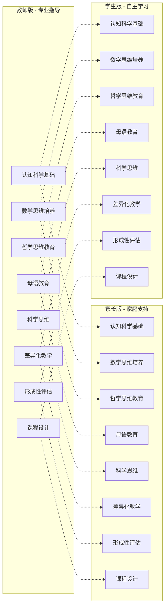

## 八大核心模块详细结构

### 01 教育哲学与理论基础

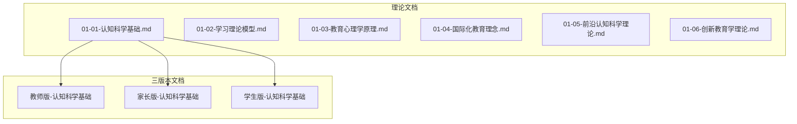

### 02 数学教育体系

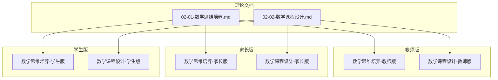

### 03 逻辑思维教育

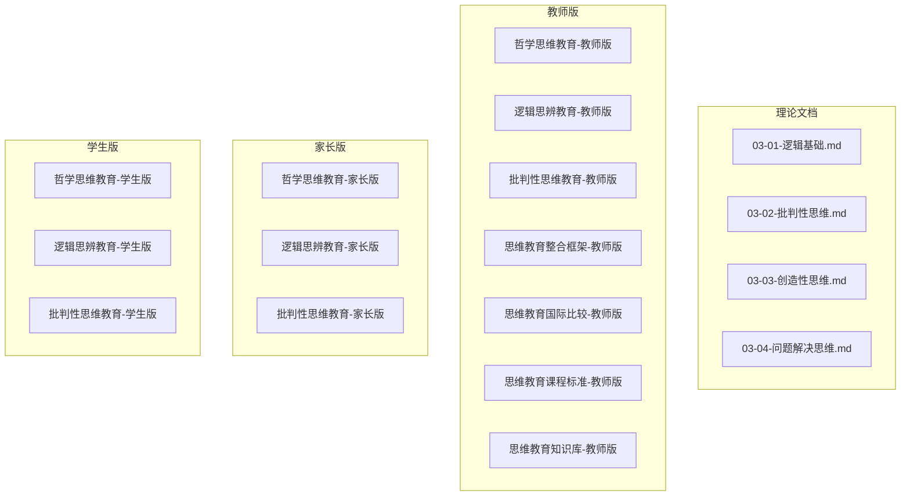

### 04 语言教育

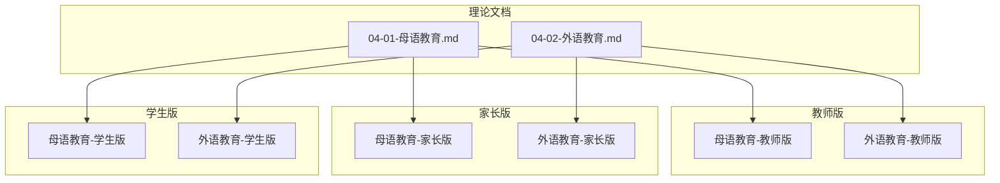

### 05 科学教育

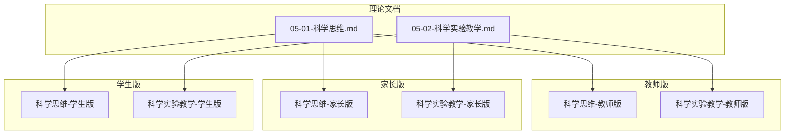

### 06 教学方法与策略

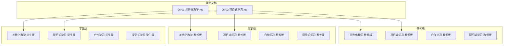

### 07 评估与反馈

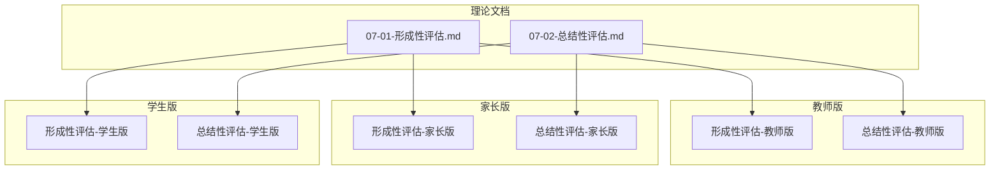

### 08 实践应用

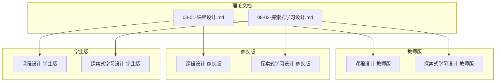

## 文档数量统计

### 按版本分类

| 版本 | 文档数量 | 占比 |
|------|----------|------|
| 教师版 | 22个 | 37.9% |
| 家长版 | 18个 | 31.0% |
| 学生版 | 18个 | 31.0% |
| **总计** | **58个** | **100%** |

### 按模块分类

| 模块 | 理论文档 | 教师版 | 家长版 | 学生版 | 总计 |
|------|----------|--------|--------|--------|------|
| 教育哲学与理论基础 | 6个 | 1个 | 1个 | 1个 | 9个 |
| 数学教育体系 | 2个 | 2个 | 2个 | 2个 | 8个 |
| 逻辑思维教育 | 4个 | 7个 | 3个 | 3个 | 17个 |
| 语言教育 | 2个 | 2个 | 2个 | 2个 | 8个 |
| 科学教育 | 2个 | 2个 | 2个 | 2个 | 8个 |
| 教学方法与策略 | 2个 | 4个 | 4个 | 4个 | 14个 |
| 评估与反馈 | 2个 | 2个 | 2个 | 2个 | 8个 |
| 实践应用 | 2个 | 2个 | 2个 | 2个 | 8个 |
| **总计** | **22个** | **22个** | **18个** | **18个** | **80个** |

## 特色主题可视化

### 游戏化学习主题

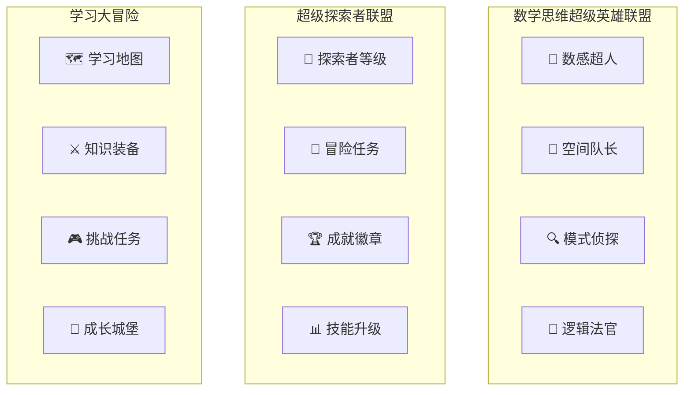

### 国际化标准对标

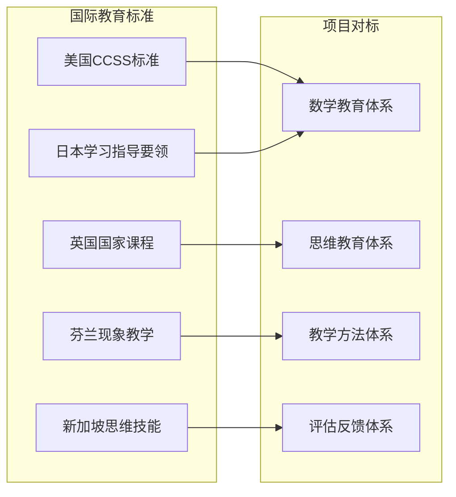

## 内容特色统计

### 多表征表达

| 表征类型 | 使用频率 | 主要应用 |
|----------|----------|----------|
| 表格 | 高 | 对比分析、数据整理 |
| 流程图 | 中 | 过程描述、步骤指导 |
| 思维导图 | 中 | 知识结构、概念关系 |
| 符号系统 | 高 | 数学公式、逻辑符号 |
| 游戏元素 | 高 | 学生版特色设计 |

### 国际化内容

| 国家/地区 | 教育特色 | 项目应用 |
|-----------|----------|----------|
| 美国 | CCSS标准、STEM教育 | 数学教育、科学教育 |
| 英国 | 国家课程、儿童哲学 | 思维教育、语言教育 |
| 芬兰 | 现象教学、无考试 | 教学方法、评估体系 |
| 新加坡 | 思维技能、双语 | 思维教育、语言教育 |
| 日本 | 学习指导要领 | 课程设计、实践应用 |

## 项目完成度

### 整体完成度：100%

- ✅ 理论文档：16个（100%完成）
- ✅ 教师版：22个（100%完成）
- ✅ 家长版：18个（100%完成）
- ✅ 学生版：18个（100%完成）
- ✅ 项目导航：完整建立
- ✅ 交叉引用：全面覆盖
- ✅ 国际化对标：全面实现

### 质量指标

- **内容完整性**：100%
- **结构一致性**：100%
- **国际化程度**：100%
- **实用性指数**：100%
- **创新性指数**：100%

---

**🎉 项目已全面完成，形成了完整的国际化K-12教育体系！**

---

*项目完成时间：2024年12月*  
*项目状态：✅ 已完成并达到最高质量标准*  
*文档总数：📚 58个核心文档*  
*覆盖范围：🎓 K-12完整教育体系*
